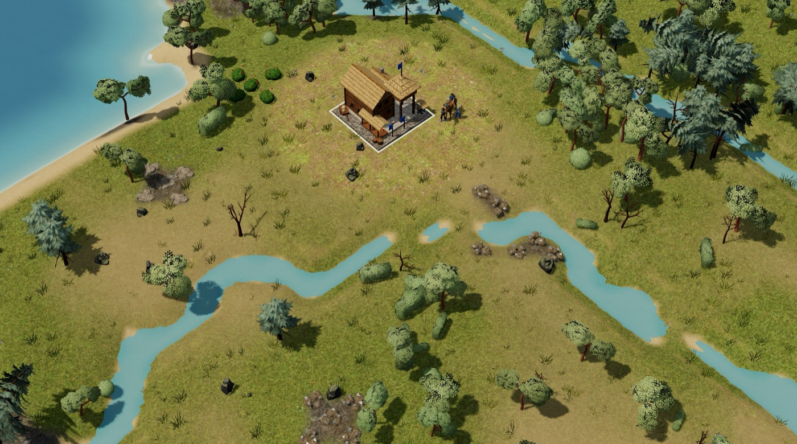
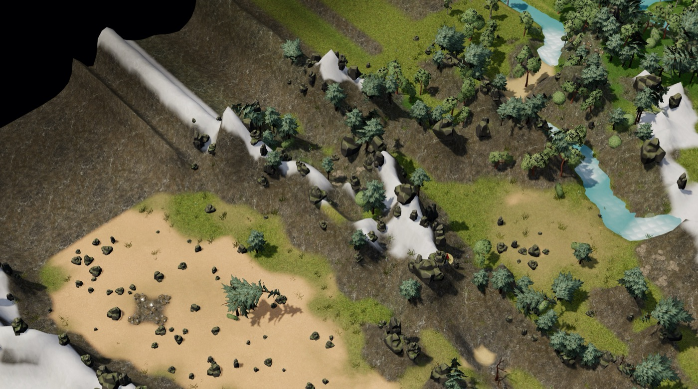
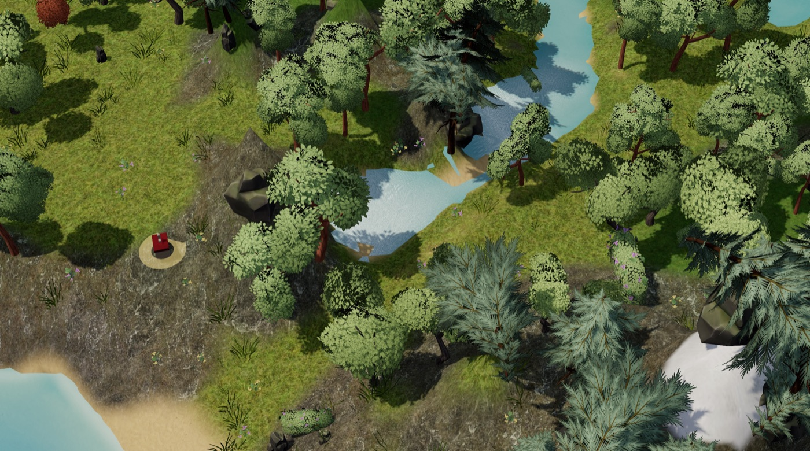
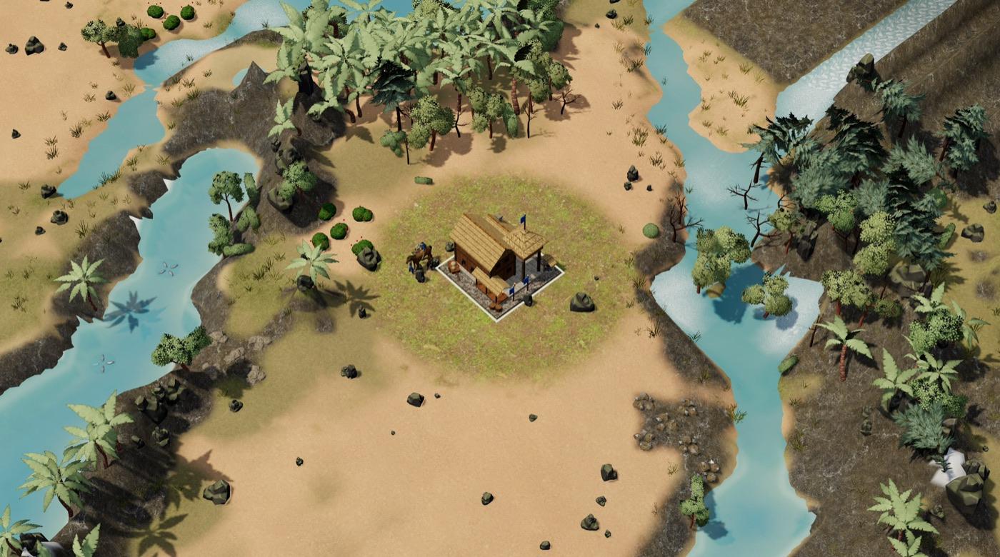
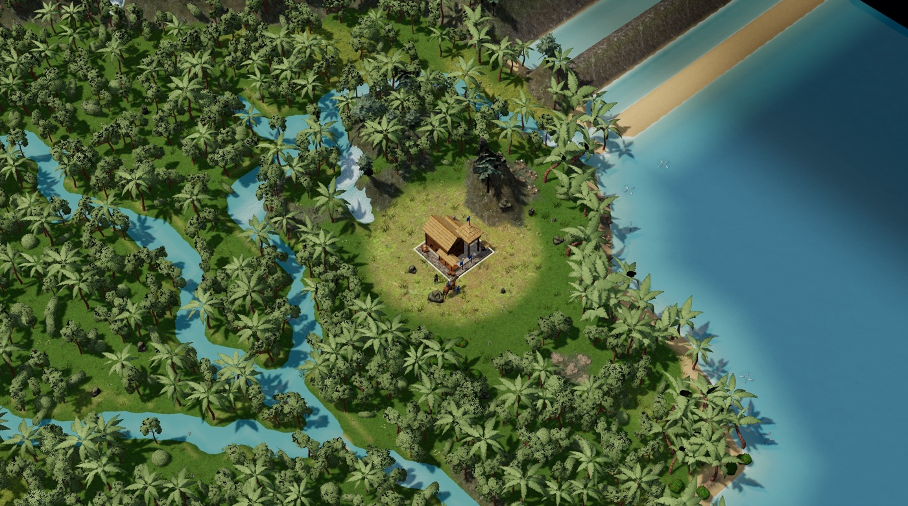

# Imperia

Juego de estrategia en tiempo real en 3D, en español, para **macOS** y **Windows**: nueve edades de la Edad Oscura al año 2100, mapas de continentes con relieve y ríos reales, partidas contra la IA y en red local.



## Descargar

En **[Releases](../../releases)**:

| Sistema | Archivo | Cómo instalar |
|---|---|---|
| macOS 13 o posterior (Apple Silicon e Intel) | `Imperia-<versión>.dmg` | Abre el DMG y arrastra Imperia a Aplicaciones. La primera vez: clic derecho sobre la app → **Abrir** (no está firmada por Apple). |
| Windows 10/11 (64 bits) | `Imperia-<versión>-Windows.zip` | Descomprime la carpeta y abre `Imperia.exe`. Si sale SmartScreen: **Más información → Ejecutar de todas formas**. |

## Qué tiene

- **9 edades**: Oscura, Feudal, de los Castillos, Imperial, Industrial, Mundial, Atómica, de la Información y del Futuro (2100), con edificios, unidades, vehículos e interfaz propios de cada una.
- **13 mapas**: 5 generados (Continental, Arabia, Bosque negro, Río, Islas) y 8 continentes con datos reales: Península Ibérica, Europa, Mediterráneo, África, Asia oriental, Norteamérica, Sudamérica y Oceanía. Montañas, ríos, lagos, cascadas, nieve por altitud y color del suelo tomado del satélite.
- **Personajes animados** (miles en pantalla con instancias en GPU), vegetación por bioma, agua con espuma y cascadas, bloom y resolución dinámica.
- **IA** en tres niveles (fácil, normal y difícil), **red local** (hasta 4 jugadores, Mac y Windows juntos; búsqueda automática o por IP), tutorial, partidas guardadas, aldeanos ociosos, resembrado automático de granjas y límite de fotogramas para ahorrar batería.

| | |
|---|---|
|  |  |
|  |  |

## Controles básicos

Clic izquierdo selecciona, clic derecho ordena (mover, atacar, recolectar, construir). Teclas del panel de órdenes `Q W E R T / A S D F G / Z X C V B` (configurables). `.` aldeano ocioso · `H` centro urbano · `M` todo el ejército · `Ctrl+1…9` grupos · `P` pausa · `F5` guardar · rueda para el zoom.

## Compilar

Requisitos: un Mac con Xcode (Swift) y Node.js.

```sh
./build.sh                 # app de Mac y DMG → build/Imperia.dmg
windows/build_win.sh       # versión de Windows (Electron) → ~/Desktop/Imperia-<versión>-Windows.zip
```

El juego es HTML/JavaScript con [three.js](https://threejs.org) (`web/`). La app de Mac es un envoltorio nativo en Swift con WebKit (`main.swift`); la de Windows, el mismo juego en Electron (`windows/`), con el mismo puente nativo para partidas guardadas y red.

Regenerar los datos (descargan los recursos originales en `assets_src/`):

```sh
node tools/build_maps.mjs      # mapas reales → web/maps_data.js
node tools/bake_nature.mjs     # árboles, rocas y plantas → web/nature_data.js
python3 tools/pack_terrain.py  # texturas del suelo → web/terrain_data.js
node tools/bake_chars.mjs tools/chars.json   # personajes animados → web/chars_data.js
```

Pruebas: `node pruebas/test_v3.js`, `test_fuzz.js`, `test_net.js`, `test_eras.js`, `test_mapas.js`, `test_guardado.js`, `test_granjas.js` (simulación determinista, red y mapas).

## Créditos

Ver [CREDITOS.md](CREDITOS.md).
